<div align="center">



<br /><br />

**List items, place live bids, and win with confidence.**

<br />

   

<br /><br />

**Part of the [InfoDot Ecosystem](https://github.com/sakhileb/InfoDot)** &nbsp;·&nbsp; `auction.infodot.app`

</div>

---

## What is Dot.Auction?

Dot.Auction is the live bidding platform in the InfoDot ecosystem. Sellers list items with a starting price and auction window; buyers bid in real time via WebSocket push — with automatic highest-bid tracking, reserve prices, and instant win notifications.

## Core Features

- Live bidding — real-time bid updates via Laravel Reverb
- Reserve price and buy-now price support
- Timed auctions with countdown and auto-close
- Bid history and winner notification
- Seller dashboard — active lots, bids received, and results
- Buyer watchlist and outbid alerts
- Dispute resolution workflow
- Ecosystem SSO from InfoDot hub

## Domain Models

- **AuctionLot** — item listed for bidding
- **Bid** — placed bid with amount and timestamp
- **AuctionResult** — final outcome and winner
- **AuctionWatchlist** — buyer interest tracker

## Tech Stack

| Layer | Technology |
|---|---|
| Framework | Laravel 12 |
| Language | PHP 8.4 |
| Frontend | Livewire 3 · Alpine.js 3 · Tailwind CSS |
| Database | PostgreSQL 16 (shared across ecosystem) |
| Realtime | Laravel Reverb |
| Auth | Laravel Sanctum (InfoDot SSO) |
| AI | Anthropic Claude (`claude-sonnet-4-6`) |
| Storage | AWS S3 / Local (Flysystem) |
| Search | Laravel Scout · Meilisearch |
| Queue | Redis · Laravel Horizon |

## Quick Start

```bash
git clone https://github.com/sakhileb/Dot.Auction.git
cd Dot.Auction
cp .env.example .env
composer install
npm install && npm run build
php artisan key:generate
php artisan migrate
php artisan serve
```

> **Ecosystem SSO:** Set `DB_*` env vars to the shared InfoDot PostgreSQL instance and `APP_URL=https://auction.infodot.app`. Users authenticated through InfoDot gain access automatically via Sanctum handoff tokens.

## Ecosystem

**Dot.Auction** is one of **21 platforms** in the InfoDot ecosystem, connected via shared PostgreSQL and Sanctum SSO. Visit [InfoDot](https://github.com/sakhileb/InfoDot) to explore the full platform map.

## License

MIT © [SK Digital / BluPin Incorporated](https://github.com/sakhileb)
