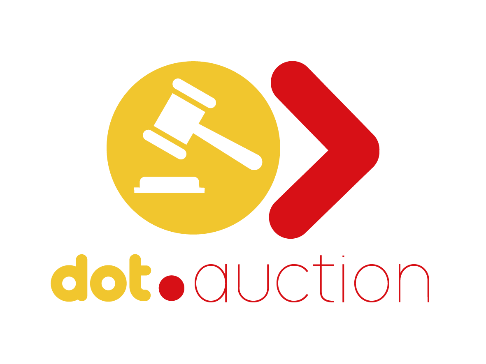

<div align="center">



<h1>Dot.Auction</h1>

<p>Real-time online auction platform — list items, place live bids, and win with confidence.</p>

[](https://php.net)
[](https://laravel.com)
[](https://livewire.laravel.com)
[](https://postgresql.org)
[](https://reverb.laravel.com)
[](tests/)
[](LICENSE)

</div>

---

## Overview

Dot.Auction is the real-time auction platform in the Dot ecosystem. Sellers list items with starting price, bid increment, reserve price, and optional buy-now price. Bidders place live bids and see the current price update instantly via Laravel Reverb WebSockets — no page refresh required.

---

## Features

- **Live auctions** — real-time bid updates via `BidPlaced` event broadcast over Reverb
- **Auto-bidding** — set a maximum and the system bids incrementally on your behalf
- **Buy-now** — instant purchase option alongside live bidding
- **Reserve price** — sellers set a hidden minimum; buyers see "reserve not met"
- **Countdown timer** — live auction end time with auto-close
- **Watchlist** — save auctions to follow without bidding
- **Bid history** — full transparency on all bids placed
- **Ecosystem SSO** — authenticate from InfoDot with a single click

---

## Real-time Architecture

```php
// BidPanel Livewire component refreshes on every new bid
#[On('echo-public:auction.{auction.id},BidPlaced')]
public function refreshBids(array $data): void { ... }

// BidPlaced event broadcasts to all watchers instantly
class BidPlaced implements ShouldBroadcast {
    public function broadcastOn(): Channel {
        return new Channel('auction.' . $this->bid->auction_id);
    }
}
```

---

## Domain Model

```
AuctionCategory → Auctions → Bids (is_winning, is_auto_bid)
                           → Watchlists
                           → AuctionItems
```

---

## Tech Stack

| Layer | Technology |
|---|---|
| Framework | Laravel 12 + PHP 8.4 |
| Frontend | Livewire 3 + Alpine.js + Tailwind CSS |
| Auth | Jetstream 5 + Sanctum (ecosystem SSO) |
| Database | PostgreSQL 16 (shared infodot instance) |
| WebSockets | Laravel Reverb (real-time bidding) |
| Payments | Laravel Cashier + Stripe |

---

## Quick Start

```bash
git clone https://github.com/sakhileb/Dot.Auction.git && cd Dot.Auction
composer install && npm install
cp .env.example .env && php artisan key:generate
php artisan migrate && npm run dev & php artisan serve
php artisan reverb:start   # Required for live bidding
```

```bash
bash bin/test.sh   # 37 passing, 0 failed, 7 skipped
```

---

## Part of the Dot Ecosystem

Dot.Auction connects to [InfoDot](https://github.com/sakhileb/InfoDot) — the central hub. Log in to InfoDot once and navigate here without re-authenticating via `/auth/ecosystem`.

---

MIT — © SK Digital / BluPin Incorporated
